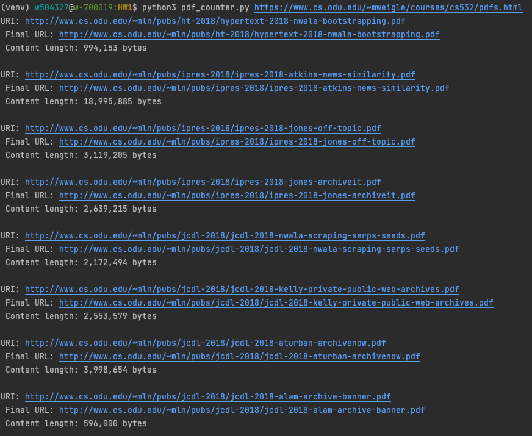

### Finding Links to PDF's in a Webpage:
This program does the following:

* Takes the URI of a webpage as a command-line argument
* Extracts all the links from the page
* For each link, request the URI and use the Content-Type HTTP response header to determine if the link references a PDF file
* For all links that reference a PDF file, print the original URI (found in the source of the original HTML), the final URI (after any redirects), and the number of bytes in the PDF file.

### To run:
`python3 pdf_counter.py <URL>`

### Result Snippet:
Results of `python3 pdf_counter.py https://www.cs.odu.edu/~mweigle/courses/cs532/pdfs.html`:

